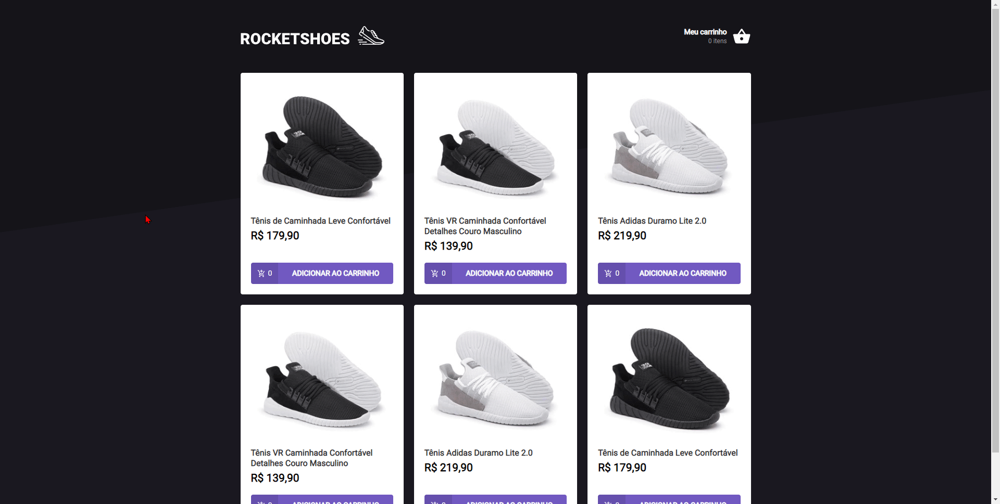

# Desafio de carrinho de compras da trilha de ReactJS da RocketSeact

-Para instalar todas as dependencias em sua máquina execute o comando 
`yarn install | npm install`

-Para executar `yarn start | npm start`

foi criado o hook de carrinho de compras com fins de estudo de reactjs e typeScript
principalmente para o estudo de hooks do react

